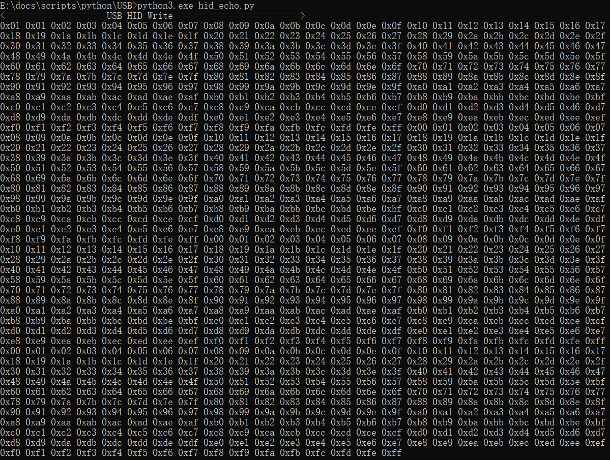

# USB HID Generic Inout

## Overview

This  example project shows USB hid generic transfers

- PC transmits a HID report to MCU,  and then MC send it back to PC

## Board Setting

- Connect a USB port on PC to the PWR DEBUG port on the development board with a USB Type-C cable
- Connect a USB port on PC to one of USB port on the development board with a USB Type-C cable

## Project Configuration

- File [cmakelists.txt](./CmakeLists.txt)：

  When BOARD_DEVICE_RHPORT_NUM is defined as 0, it means to use USB0.

  When BOARD_DEVICE_RHPORT_NUM is defined as 1, it means to use USB1.
- The property of USB device can be configured by "tusb_config.h" or "CMakeListx.txt"

## Running the example

When the project runs correctly

- Enter the relative path to "samples\tinyusb\device\hid_generic_inout"
- Run hid_echo.py
- View  "USB HID Write" log： PC transmits 1024 bytes to MCU through USB and the first byte is the output report id

  
- View "USB HID Read" log: PC receives 1024 bytes to MCU through USB and the first byte is the output report id

  
